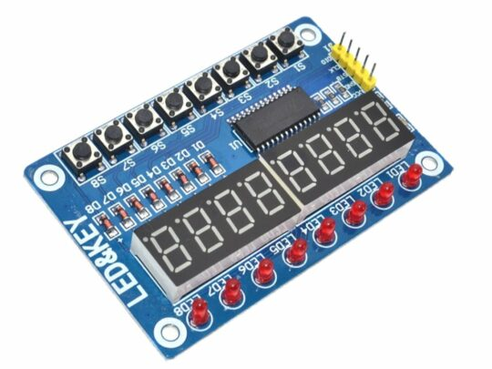

Dedicated I/O Device for Small Computers
========================================

This project is to create a "standard" user interaction device which
offloads the common display and I/O things that someone writing programs
on resource constrained systems would otherwise have to do themselves.

The fields of computer science and computer engineering have exploded with
the reduction in cost of computer systems. What cost $1,000,000 dollars
in 1970, cost $100,000 in 1980, cost $10,000 in 1990, and $1,000 in 2000,
then $100 in 2010, and $10 in 2020. The lower costs brought about many
many applications and computers are in everything from light switches
to rocketships. But _learning_ computers suffers from all this choice,
the learning curve has been made artificially steep by the choices for
everything that make up a computer system. This has, for many, resulted
in a resurgence of "retro" computer recreations and simulations.

My "ah ha!" moment was teaching a student to program in the C language.
For **_me_**, it started simply with a four line program:
```C
#include <stdio.h>
int main(int argc, char *argv) {
    printf("Hello world!\n");
}
```
For the student though, using an Ardunio board, it was much more complicated.

The complication was entirely centered around importing Arduino libraries
to do do serial I/O, and then to connect those to the "Serial Monitor"
and then having to initialize the serial subsystem and write to it. In
my first experience, all of that complexity was hidden by two things,
the operating system did the serial initialization and the computer
terminal handled all of the collecting my keystrokes and sending me text.

Pondering that, I realized that the lack of any sort of defacto 'standard'
terminal made simplifying the early steps of programming impossible. It
also meant that if you _did_ want to display text or simple graphics,
which were both things that were handled by the _terminal_ when I was
learning to program, you needed even more complexity of adding graphics
libraries and fonts and display chip drivers. And I asked, is there
something I could do here to help simplify this? To reduce the steepness
of the learning curve by abstracting away things that you don't need to
know about to learn to program?

I thought perhaps if there was a standard 'terminal' that hooked up
to these development boards in a such a way that they allowed the
people providing tutorials and software packages to inquire about the
capabilities in a standard way, and interface with them in a standard
way, then it would be much simpler and we could make `helloworld.c`
a very simple program for the new programmer once again.

## What is a terminal?

In my office I have a Digital Equipment Corporation (DEC) [VT-420
terminal](https://en.wikipedia.org/wiki/VT420).  It displays 25 lines
of text of up to 80 characters per line, and connects with a computer
via the RS-232 serial interface standard. I also have a VT-340 terminal
which can display text in one of 256 different colors, and can draw
simple graphics on the screen.

All of the software that DEC wrote could use either terminal, what
is more they could change their behavior based on which terminal they
were interfacing to. They did that by virtue of the terminal sending an
"identifier" string when asked by the computer. The letters and the
font used were up to the terminal although there were somethings you
could change like bold, underlining, reverse video, or flashing. And
even terminals that were character driven, some characters were lines
and curves so you could build simple boxes.

On the computer side, all of the communication goes across the serial
line so from an I/O perspective that is fairly simple. And all of the
'features' of the terminal are accessed by sending special "escape"
characters that the  terminal interpreted not as characters to display but
as an operation to perform such as moving the cursor, clearing the screen,
or changing the display attributes of the next character on the screen.

Terminals would also typically have a keyboard that the _terminal_
would scan and watch of key presses and translate those key presses into
characters that would be sent back over the serial line to the computer.

This was all of the I/O needed in my college career to teach an
entire computer science curriculum! And once one understood all of the
foundational rules of computer programming, adding in graphical user
interfaces, or other more complicated computer/device interactions
were simpler because the student was not trying to understand computer
programming at the same time as these other concepts.

## What's wrong with special purpose libraries?

Nothing! That's the easiest answer, and programmers will always encounter
them with modern programming environments. We can however limit the
_exposed complexity_ for doing human/machine interactions and reduce the
cognitive load of learning by creating a flexible interface that can be
used simply.

The goal then is to reduce the Arduino hello world program to this:

```
#include <spi_term.h>
#include <stdio.h>

void setup() {
    SpiTerm.init();
    printf("Hello world!\n");
}
void loop() { }
```

And for that program to work _for any conforming SPI terminal_ that is
attached to the board used for development. What is more, the program
would work _when not connected to a "big" computer, only to power._

That latter bit is where the real difference in having a "terminal"
becomes apparent. When I was learning to program I would often program
simple games and they would interact with the terminal by asking questions
and then responding based on those inputs. I didn't need anything other
than the computer and the terminal.

When [micropython](https://micropython.org/) came out I thought this is
really cool, I don't need a desktop or laptop PC to program this _if I
can connect it to a terminal_.

## The SPI Terminal Project

The SPI terminal project arose from these observations and I began to
identify what would make for a successful solution to the situation
and accelerate students understanding of computers, and generally make
embedded systems that we typically see today much more interactive much
more easily.

The simplest description of this project is as a serial peripheral device
or SPD. Using a serial interface, this device provides display(s) of
and input(s) for user data. A block diagram might look like figure 1.

[image of spd and microcontroller]

## The Interfaces

This project exploits the fact that most microcontrollers in production
provide a peripheral that can communicate serially with a peripheral. In
the cases where the microcontroller does not supply its own interface, the
simplest one, SPI, can be easily 'bit banged' out without any specific timing
requirements on the part of the microcontroller. 

The three interfaces that are supported by SPI-Term are the serial peripheral
interface (SPI), the inter-integrated circuit interface (I2C), and the
universal asynchronous serial interface or (UART).

In addition to those interfaces, four signal lines are common to all interfaces.
These are:
  * V+, the positive voltage supply (this powers the SPI-Terminal)
  * GND, the ground reference and supply return. (this is the signal all other 
    signals are relative too)
  * PDA, peripheral data available, this indicates the SPI-Terminal has data
    from the user to send.
  * RESET, to reset the SPI-Terminal into a known state.

The signalling levels, or what counts as 1's or 0's on the line, are all 
nominally something greater than 1.5V as logic level '1', and ground
or < 0.25V for logic level '0'. The maximum level should be no more than 5v
and the low level should be non-negative. The I2C pins are 'open collector'
which means they expect to be pulled to a logical '1' level by the 
microcontroller, and either the microcontroller or the peripheral will pull
them down to ground (0v) when sending logic 0's on them. 

Whichever interface is in use, they expect the pins V+ and GND to be
connected to the logic voltage supply and the digital ground of the
microcontroller. Different implementations of SPI-Term will have different
current requirements. The SPI-Term specification requires that a SPI-Term 
accept any voltage between 3.3V and 5v on the V+ pin and it will convert
that internally if necessary to the power needed by the device. 

### SPI Interface

The simplest serial interface is the serial peripheral interface which
presents as 4 I/O lines to the microcontroller. These are nominally
serial clock (SCLK), peripheral-out/host-in (POHI), host-out/peripheral-in
(HOPI), and device select (DS). It shares two lines, reset and peripheral
data available with the other interfaces.

These are, of course, the same definitions as the SPI interface made popular
by Texas Instruments with the pesky master and slave bits renamed.

he addition of PDA to this definition is there because our device generates
data from a user's key presses, knob turning, or pointer movements. Rather
than have the micro-controller continually poll the device to see if something
has happened, we collect all of those events into this single signal that
originates on our device and is an input into the host.

The host can send data to our peripheral at any time. The use of DS tells the
peripheral that the host is now speaking and asks as a 'start of transaction'
signal. 

Of the three interfaces, this one has the most pins (8) which are the four
SPI pins and the four shared pins (V+, GND, PDA, RESET).

### I2C Interface

The I2C interface is slightly more complicated than SPI while using two fewer
I/O pins. The signals are serial data (SDA) and serial clock (SCLK).

Like SPI it is a clocked interface where data is clocked into the
device by the serial, unlike SPI it sticks to one of three "standard" rates,
either 100 kHz, 400 kHz, or 1 MHz clock rates. This makes it slower than
SPI but it uses fewer signal lines. 

### Serial Interface

This is the 'classic' terminal I/O interface although back in the day it used
RS-232, a signaling standard that replaced logic levels with levels that were
plus or minus 12v. That enabled RS-232 cables to go the long distance between
the machine room where the computer was, to room where the terminal was
situated. In todays environments the computer is quite portable and generally
sitting right next to the terminal. This means using standard logic levels
between the computer and terminal does not impair the utility of the terminal.

An asynchronous serial interface works well at the expense of having to agree
ahead of time what the clock (or baud) rate is. Back in the day, 9600, 38400,
and 115200 were all valid baud rates. The spi-term limits itself to 115200
which is "fast" as terminals go and doesn't result in errors even when the 
signal lines are "long". Of the three interfaces it is the slowest though.

The serial interface uses two pins, transmit (TX) and receive (RX). This gives
it the same number of pins as I2C (6, two for the interface and 4 in common)
but unlike I2C they are unidirectional so they can send data at the same time
they are reciving data.

### Interface Summary

Each of these choices has plusses and minuses and the SPI-Term supports all
three so that the trade-offs can be made based on what you are trying to do
with it. All of the capabilities of the SPI-Term are accessible over any of
the interfaces however they will have differences in how those capabilities
are used. This will be discussed more in the software section.

## Why Three Versions?

In my grant proposal I outlined three realizations of this idea, we can call
them 'mini', 'regular', and 'max'. The explanation for three versions is that
terminals, like any system, are a set of compromises based on expected use.
If you have done any engineering professionally you will immediately recognize
these as the constraints on the design space. So let's look at the constraints
and why they exist for a moment.

### The "mini" SPI-Term

I got started down that path when the display I would have used for
a project was no longer available. This led me to the problem of needing
new libraries for an equivalent display that I _could_ get. Of course
ordering a new display and waiting for it to arrive can be time consuming
so in the interim I had a display in my "junk pile" that would be a servicable
intermediary display. I call this the "Oh gosh, now I need
to load a different library and change my code because this display is
different than the one I was using." problem.

I also had a bunch of "BluePill" boards. These boards are a cheap knock-off
of the
[Maple Mini](https://stm32-base.org/boards/STM32F103C8T6-Maple-Mini-Clone.html)
which was an STM32F103 based SBC that people used with the Arduino platform.
Because of the popularity of the chip, there were many knock-offs and you
could (and still can as of this writing!) buy them for about a $1 each on 
[Aliexpress](https://www.aliexpress.us) (search for 'blue pill stm32')
from a bunch of different vendors.

So the "simple" thing for me to do, was to write some firmware for the
BluePill that acted like an I2C peripheral and emulated the display I
was going to use, while driving the display I had on hand.

Flash forward to when the display I ordered arrives, and it dawns on me that
I don't really _need_ to swap out the setup, just the display I'm using. And
that was when I thought it would be a good idea to create a "standard" display
and then I could use what ever display I had on hand and it should "just work."

While debugging, I had wired up some push buttons to the BluePill and set it
up to capture their state in an emulated "register" of my i2c device. I did
that so that I could more easily debug things and send signals to my program
which was on the main microcontroller. 

When I stepped back away from the project it occurred to me I had created a
somewhat more capable
["LED & Key"](https://www.universal-solder.ca/product/led-and-key-module-for-arduino-with-tm1638/)
gizmo that folks had been using with Arduinos already. 

<div style='width:600px; margin:0 auto;'>

<br>

The LED and Key peripheral worked over a serial interface and let you display
digits or on/off LEDs, and to monitor pushbuttons in software on the _host_ 
microcontroller. It contained no 'smarts' of its own.
</div>


